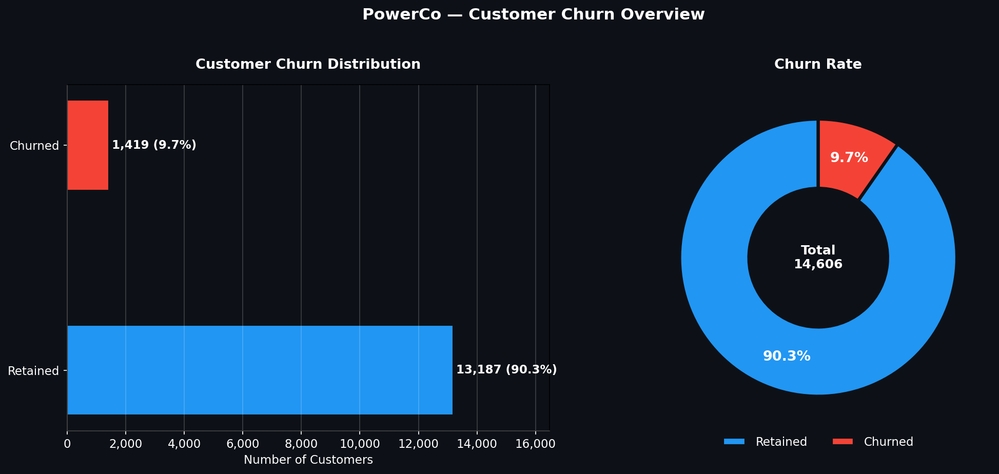
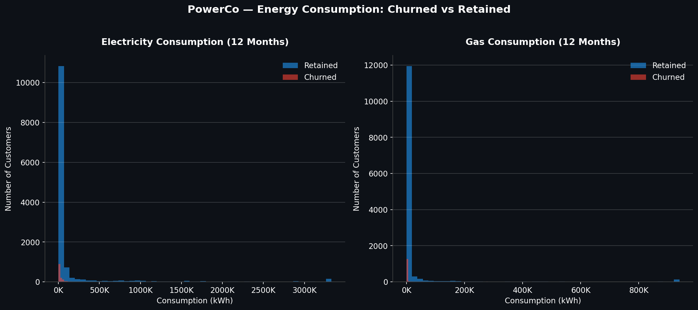
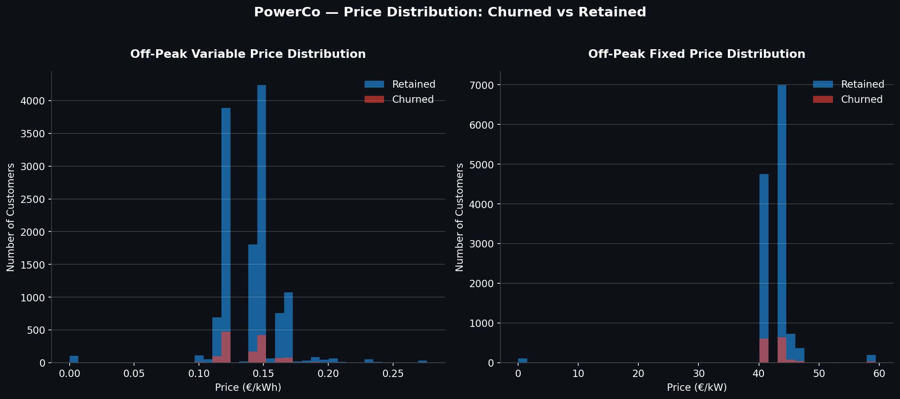
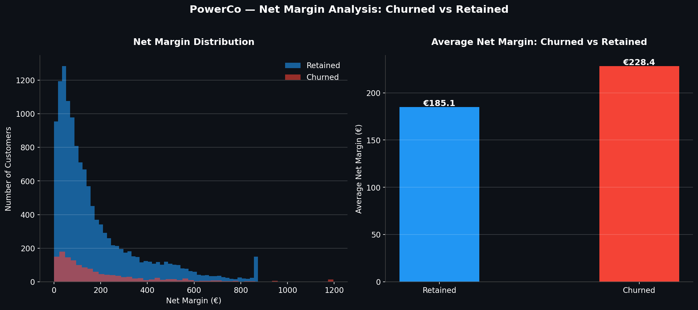
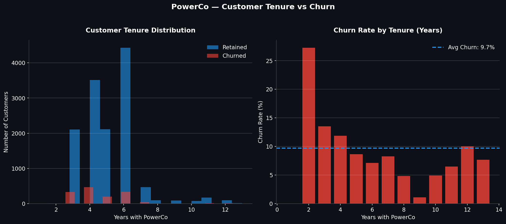
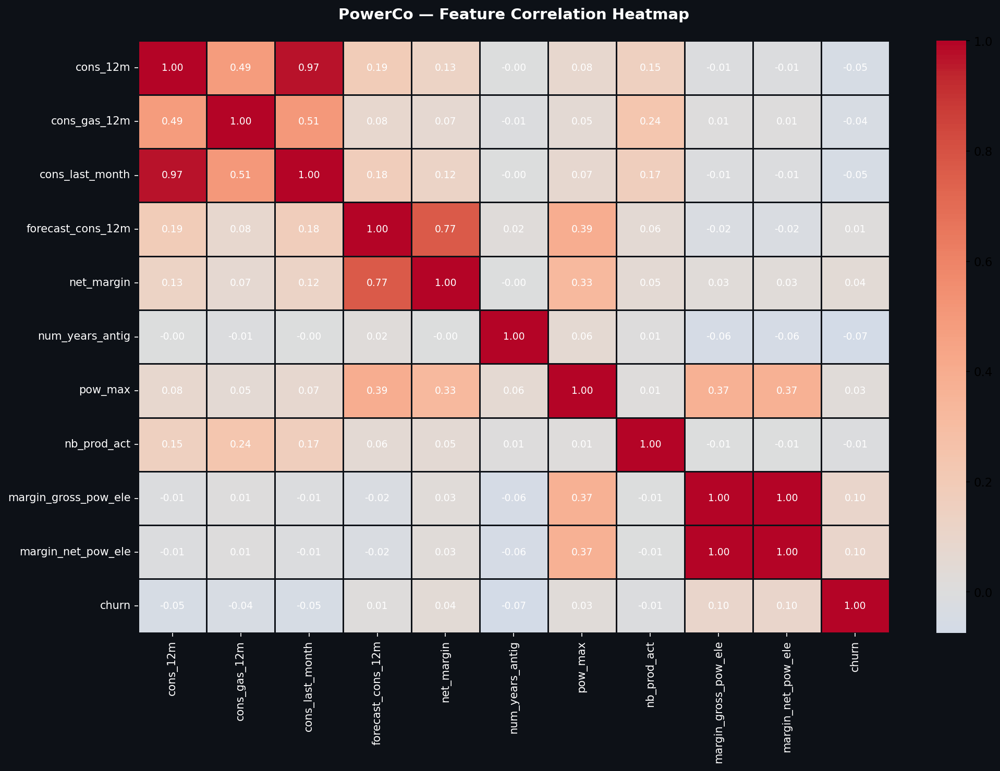
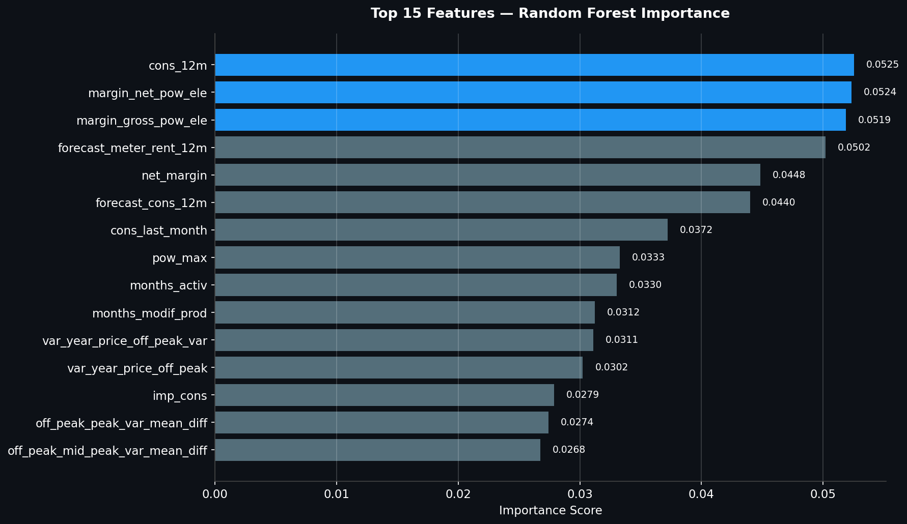
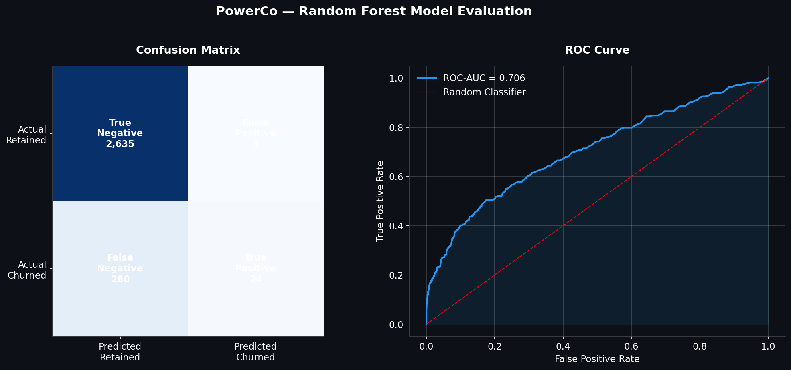

<div align="center">


[](https://git.io/typing-svg)

<br>


<br>

[](https://www.linkedin.com/in/devesh-shukla23)
[](https://github.com/DeveshShukla23)

</div>

---

## 🧠 About This Project
```python
project = {
    "name"        : "BCG X Data Science Job Simulation",
    "platform"    : "Forage",
    "company"     : "BCG X — Boston Consulting Group's Tech & Digital Ventures",
    "completed"   : "March 23rd, 2026",
    "client"      : "PowerCo — SME Gas & Electricity Provider",
    "tasks"       : 5,
    "dataset"     : "14,606 SME Customers | Energy Consumption & Pricing Data",
    "tools"       : ["Python", "Pandas", "NumPy", "Scikit-Learn", "Matplotlib", "Seaborn"],
    "skills"      : ["EDA", "Feature Engineering", "Random Forest", "ROC-AUC",
                     "Business Hypothesis Testing", "SCQA Framework", "Executive Reporting"],
    "outcome"     : "🏆 Certificate Issued — Data Science Job Simulation"
}
```

> 💡 *"PowerCo thought price was killing their business. I let the data speak — and it told a completely different story."*

---

## 📊 Key Metrics

<div align="center">

| 👥 Total Customers | 🚨 Churned | 📉 Churn Rate | 🤖 Model ROC-AUC |
|:---:|:---:|:---:|:---:|
| **14,606** | **1,419** | **9.7%** | **0.71** |

</div>

---

## 📁 Repository Structure
```
📦 BCG-Data-Science-Job-Simulation/
│
├── 📓 BCG_Task3_EDA.ipynb                    → Exploratory Data Analysis
├── 📓 BCG_Task4_Feature_Engineering.ipynb    → Feature Engineering
├── 📓 BCG_Task5_Modeling.ipynb               → Random Forest Modeling
├── 📄 BCG_Executive_Summary.pdf              → SCQA Business Report
├── 📊 churn_distribution.png
├── 📊 consumption_analysis.png
├── 📊 correlation_heatmap.png
├── 📊 feature_importance.png
├── 📊 margin_analysis.png
├── 📊 model_evaluation.png
├── 📊 price_analysis.png
├── 📊 tenure_analysis.png
└── 📄 README.md
```

> ⚠️ **Note:** Raw data files excluded per BCG X confidentiality policy.

---

## 🔬 Executive Summary — SCQA Framework
```
📍 SITUATION
└── PowerCo has a 9.7% churn rate (1,419 of 14,606 customers)
    Churned customers have HIGHER avg margin (€228 vs €185)
    → The business is losing its most valuable clients first

⚠️ COMPLICATION
└── PowerCo hypothesised price sensitivity as the primary churn driver
    Analysis shows price is NOT the key driver
    → Consumption, margin & tenure are stronger predictors

❓ QUESTION
└── Is price sensitivity the primary driver of SME churn at PowerCo?
    Can a targeted discount strategy reduce churn while protecting margins?

✅ ANSWER
└── Random Forest model (ROC-AUC: 0.71) identifies at-risk customers
    Offer 20% discounts ONLY to high-margin, high-consumption customers
    Focus on early-tenure customers (1–3 yrs) — ~27% churn rate
    Refine model recall before full rollout
```

---

## 🎯 Task 3 — Exploratory Data Analysis

### Methodology

| Step | Action |
|:---:|:---|
| 🧹 Data Cleaning | Handled missing values, outliers, data type conversions |
| 📊 Churn Analysis | Distribution of churned vs retained across all features |
| ⚡ Consumption | Electricity & gas usage patterns by churn status |
| 💰 Price Analysis | Off-peak variable & fixed price distributions |
| 📈 Margin Analysis | Net margin comparison — churned vs retained |
| 📅 Tenure Analysis | Churn rate by years with PowerCo |
| 🔥 Correlation | Feature correlation heatmap |

### 🔍 Key EDA Findings
```
📌 9.7% churn rate          → 1,419 of 14,606 customers churned
📌 Churned avg margin €228  → vs €185 retained — losing best clients!
📌 New customers (1-2 yrs)  → ~27% churn rate — 3x the average
📌 Price distributions      → nearly identical for churned vs retained
📌 Consumption patterns     → clearly differ between churned & retained
📌 cons_12m & cons_last_month → 0.97 correlation — highly related
```

### 📸 EDA Visualizations








---

## ⚙️ Task 4 — Feature Engineering

### Methodology
```
Step 1 → Price variability features (off-peak vs peak mean differences)
Step 2 → Tenure-based features (months active, months since product change)
Step 3 → Consumption ratio features (last month vs 12-month avg)
Step 4 → Margin-based features (gross vs net power electricity margin)
Step 5 → Final feature selection → exported as final_features.csv
```

### Key Engineered Features

<div align="center">

| Feature | Description |
|:---|:---|
| `off_peak_peak_var_mean_diff` | Price variability between off-peak & peak periods |
| `off_peak_mid_peak_var_mean_diff` | Price variability between off-peak & mid-peak |
| `months_activ` | Number of months customer has been active |
| `months_modif_prod` | Months since last product modification |
| `var_year_price_off_peak` | Year-on-year off-peak price change |

</div>

---

## 🤖 Task 5 — Modeling & Evaluation

### Methodology
```
Step 1 → Train/Test Split (80/20)
Step 2 → Handle class imbalance
Step 3 → Random Forest Classifier training
Step 4 → ROC-AUC evaluation
Step 5 → Feature importance extraction
Step 6 → Business interpretation of results
```

### 📊 Model Results

<div align="center">

| Metric | Score |
|:---:|:---:|
| **ROC-AUC** | **0.706** |
| True Negatives (Correctly Retained) | **2,635** |
| False Negatives (Missed Churners) | **260** |

</div>

### 🏆 Top 15 Feature Importances

| Rank | Feature | Importance Score |
|:---:|:---|:---:|
| 🥇 1 | `cons_12m` — 12-month electricity consumption | 0.0525 |
| 🥈 2 | `margin_net_pow_ele` — Net power electricity margin | 0.0524 |
| 🥉 3 | `margin_gross_pow_ele` — Gross power electricity margin | 0.0519 |
| 4 | `forecast_meter_rent_12m` — Forecasted meter rent | 0.0502 |
| 5 | `net_margin` — Overall net margin | 0.0448 |
| 6 | `forecast_cons_12m` — Forecasted consumption | 0.0440 |
| 7 | `cons_last_month` — Last month consumption | 0.0372 |
| 8 | `pow_max` — Max power subscribed | 0.0333 |
| 9 | `months_activ` — Months active | 0.0330 |
| 10 | `months_modif_prod` — Months since product change | 0.0312 |

> 🔑 **Price features ranked well below consumption & margin** — confirming price is NOT the primary churn driver!

### 📸 Model Visualizations




---

## 💡 Business Recommendations

<div align="center">

| # | Recommendation | Data Behind It |
|:---:|:---|:---|
| 1️⃣ | **Do NOT apply blanket 20% discounts** | Price is NOT the primary churn driver |
| 2️⃣ | **Target high-margin + high-consumption customers** | Top features in Random Forest model |
| 3️⃣ | **Focus on 1–3 year tenure customers** | ~27% churn rate — 3x the average |
| 4️⃣ | **Improve model recall before full rollout** | Current model misses some churners |
| 5️⃣ | **Use RF model to proactively flag at-risk customers** | ROC-AUC: 0.71 — good discriminatory power |

</div>

---

## 🛠️ Tech Stack

<div align="center">


</div>

---

## 💼 Skills Demonstrated

<div align="center">

| Analytics | Machine Learning | Business |
|:---:|:---:|:---:|
| ✅ End-to-end EDA | ✅ Random Forest Classifier | ✅ SCQA Framework Reporting |
| ✅ Feature Engineering | ✅ ROC-AUC Evaluation | ✅ Executive Summary Writing |
| ✅ Data Visualisation | ✅ Feature Importance Analysis | ✅ Hypothesis Testing |
| ✅ Correlation Analysis | ✅ Class Imbalance Handling | ✅ Business Recommendations |

</div>

---

## 🏆 Certificate of Completion

<div align="center">

| Field | Details |
|:---:|:---|
| 🏅 **Certificate** | Data Science Job Simulation |
| 🏢 **Issued By** | BCG X via Forage |
| 📅 **Completed** | March 23rd, 2026 |
| 🔗 **View Certificate** | [Click Here](https://www.theforage.com/completion-certificates/SKZxezskWgmFjRvj9/Tcz8gTtprzAS4xSoK_SKZxezskWgmFjRvj9_hbKXAXgYSyRv56eS5_1774246560082_completion_certificate.pdf) |

</div>

---

## 👨‍💻 Author

<div align="center">

**Devesh Shukla**
*Data Analyst | ML Enthusiast | Insight Storyteller*

[](https://www.linkedin.com/in/devesh-shukla23)
[](https://github.com/DeveshShukla23)
[](mailto:shukladevesh40@gmail.com)

<br>

⭐ **If you find this useful, please give it a star!** ⭐


</div>
